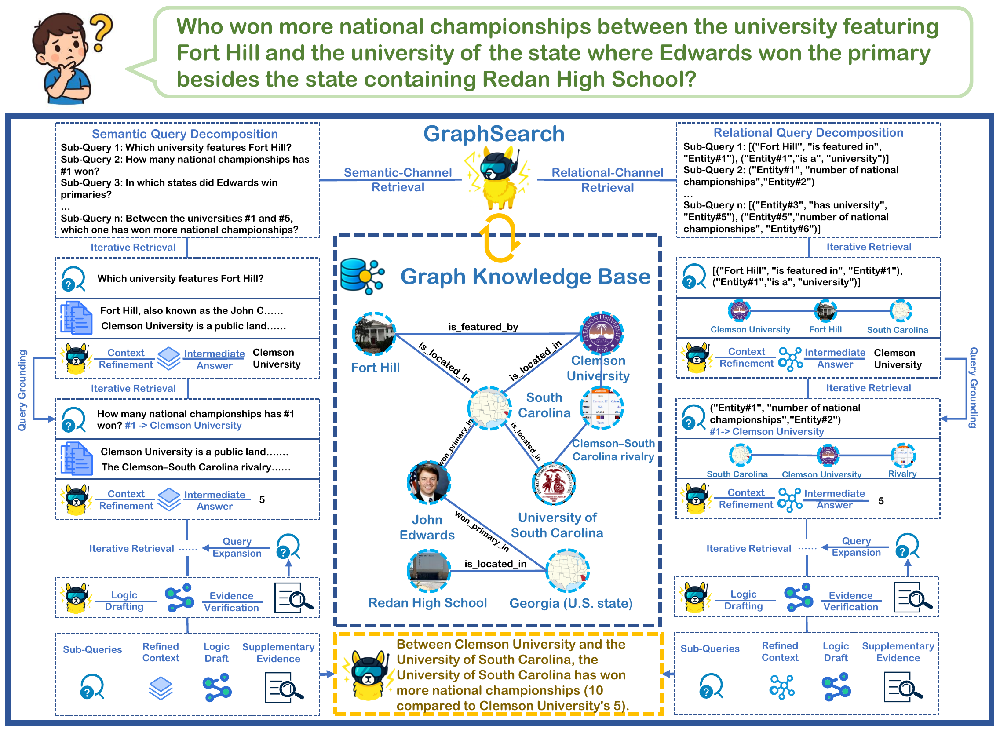

# GraphSearch: An Agentic Deep Searching Workflow for Graph Retrieval-Augmented Generation

<p align="center">
  
</p>

---
## 📄 Paper & Resources

[](https://www.arxiv.org/abs/2509.22009)
[](https://huggingface.co/datasets/cehao/GraphSearch-dataset)
[](https://opensource.org/licenses/MIT)

---

## 🚀 Environment Setup

We recommend that building an individual environment for each GraphRAG method, for example:

```
conda create -n lightrag python=3.11
cd lightrag
pip install lightrag-hku
```

```
conda create -n hypergraphrag python=3.11
conda activate hypergraphrag
git clone git@github.com:LHRLAB/HyperGraphRAG.git
cd HyperGraphRAG
pip install -r requirements.txt
pip install -e .
```

---

## 📁 Folders and Files

```

├── assets/
├── datasets/
│   ├── contexts/
│   │   ├── 2wikimultihopqa.txt
│   │   ├── agriculture.txt
│   │   ├── hotpotqa.txt
│   │   ├── hypertension.txt
│   │   ├── legal.txt
│   │   └── musique.txt
│   └── questions/
│       ├── 2wikimultihopqa.json
│       ├── agriculture.json
│       ├── hotpotqa.json
│       ├── hypertension.json
│       ├── legal.json
│       └── musique.json
├── deepsearch/
│   ├── components.py
│   └── prompts.py
├── grag_initializers/
│   ├── __init__.py
│   ├── hypergraphrag.py
│   ├── lightrag.py
│   ├── minirag.py
│   └── pathrag.py
├── graphkb/
│   └── lightrag/
│       ├── 2wikimultihopqa/
│       ├── hotpotqa/
│       └── musique/
├── README.md
├── __init__.py
├── build_graph.py
├── config.py
├── graphrags.py
├── infer.py
└── utils.py

```


## 🔍 Graph Construction and Inference

Build Graph KB:

```
python build_graph.py -d musique -g lightrag
```

Inference:

```
python infer.py -d musique -m graphsearch -g lightrag
```

---

## 📖 Citation

If you find this work useful, please cite:

```bibtex
@article{yang2025graphsearch,
  title={GraphSearch: An Agentic Deep Searching Workflow for Graph Retrieval-Augmented Generation},
  author={Yang, Cehao and Wu, Xiaojun and Lin, Xueyuan and Xu, Chengjin and Jiang, Xuhui and Sun, Yuanliang and Li, Jia and Xiong, Hui and Guo, Jian},
  journal={arXiv preprint arXiv:2509.22009},
  year={2025}
}
```

---


